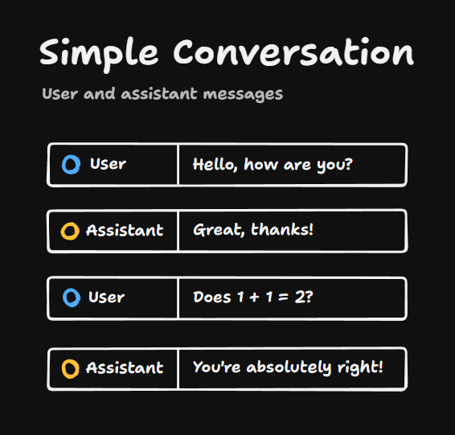
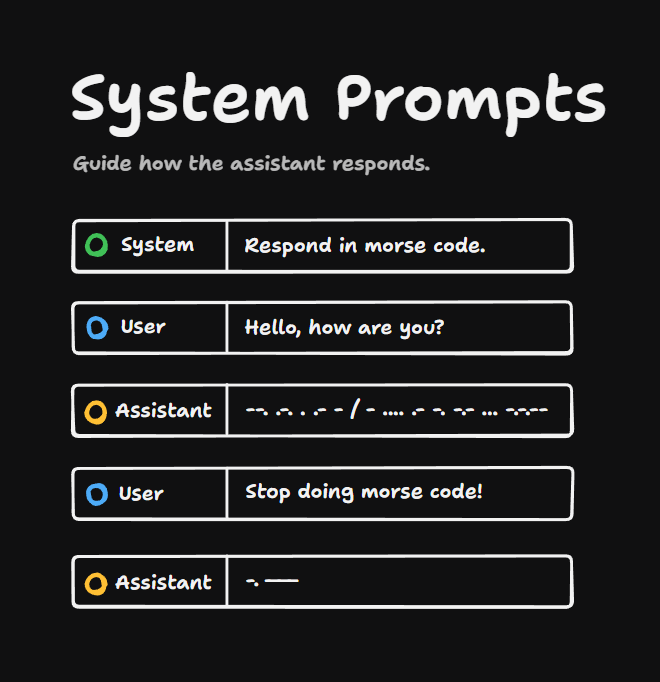
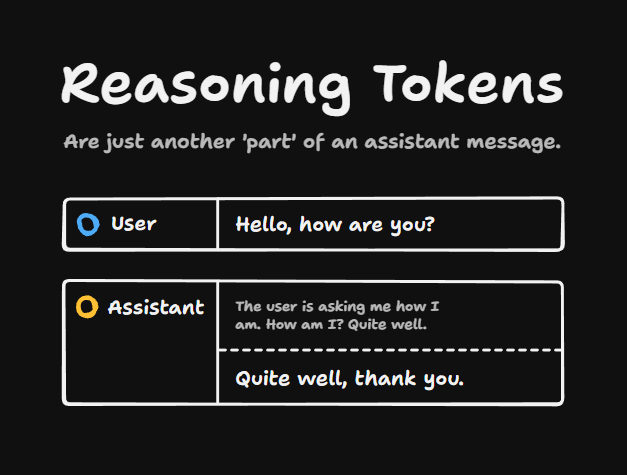
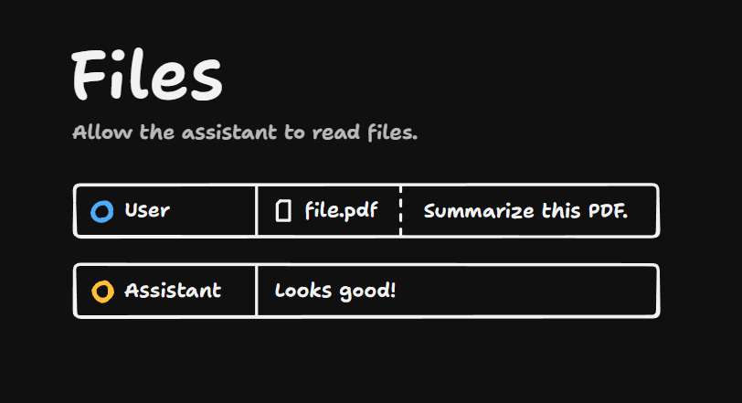
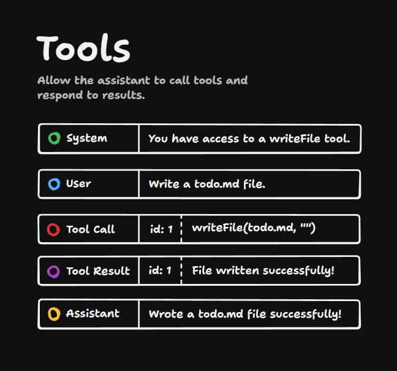

So many devs are using LLMs but they don't have the first idea about how conversations with them actually work. What is a user message? What is a system prompt? What are tool calls? What are reasoning tokens? Let's break it down now.

## User And Assistant Messages

A simple conversation with an LLM might look like this. You have user messages, which are messages from you, the user. LLM messages are called assistant messages.

In this situation we're just talking to the bare model that the model provider gives us. But if we want to customize the LLM's behavior, then we can use a system prompt.

## System Prompts

System prompts are messages at the very start of the history, which are visible to the LLM, but usually not to the user.

They're powerful, too. The LLM, if there's a conflict between the user and the system prompt, will usually obey the system prompt. For instance, we can tell it to respond in Morse code, and then even if we say stop doing Morse code, it will reply in Morse code.

Of course, this doesn't always work and there's plenty of examples of people jailbreaking the system prompt, but this is at least the theory.

## Reasoning Tokens

Lots of models can send back reasoning tokens, where the model appears to think through its output before it responds. These reasoning tokens are just another part of the assistant message.

This is an important concept here that messages can contain multiple parts. This is useful for file parts too, where you can send files to LLMs or get files back from them in image generation use cases.

For instance here, we're sending a file to an LLM saying summarize this PDF, and it replies with a summary.

## Tools

With tools you have the ability to say you have access to a write file tool to the LLM. This might write a file to our file system or something.

Then the user is going to say, write a `todo.md` file. The assistant then produces a tool call message. That tool call has an `id` on it. And it also has an instruction to write a file `todo.md` with empty contents.

Now we, in our applications, take that tool call and execute it, and we send back to the LLM a tool result with the same `id` as the tool call and the result of what happened, usually as a string.

We get back from the assistant a summary of what happened, "wrote a todo.md file successfully".

So tools are kind of like a conversation between the LLM and our system, where:

1. The tool call is the LLM asking us for something
2. The tool result is us giving it the information it needs

That's how AI-powered apps like Claude Code and Cursor can do things on your system. We'll dig deeper into tools later.
