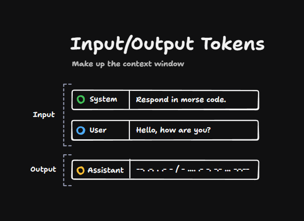
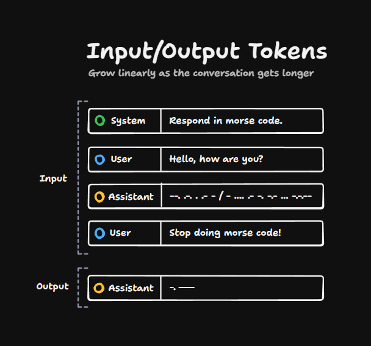
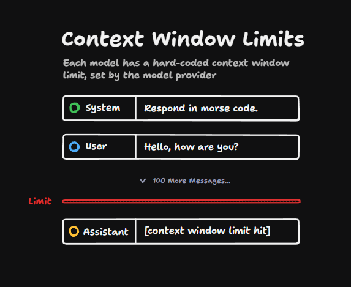
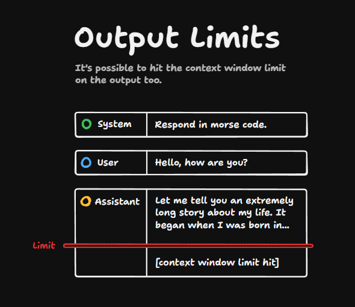
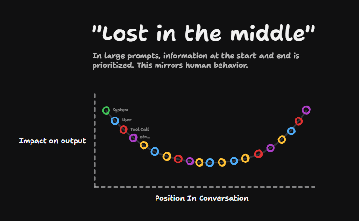

The context window is made up of input and output tokens. The input tokens might include a system prompt and a user prompt (the message from the user). And then the output tokens is whatever the assistant comes back with:

The context window is the input _and_ output tokens combined.

As the conversation gets longer, as more and more messages get put into the conversation, the number of tokens used grows.

And as you can imagine, this can't go on forever. Every model has a hard-coded limit for the number of tokens it can see at any one time.

## Context Window Limits

If we imagine a super long conversation, eventually we will hit a limit. And if you try to query the LLM with this super long conversation and you hit the limit, then you will probably get some kind of error back from the API.

You might even hit the limit during the generation of a message. So this message might start outside the context window limit, but as it goes or it carries on until it hits the context window limit.

The model itself isn't quite smart enough to work around its own context window limits. And so you will hit issues like this sometimes.

## The "Lost in the Middle" Problem

But the biggest issue with context windows is that the bigger they get, the more "lost in the middle" issues you get.

If we imagine a huge conversation, where these rings are the individual messages, the messages at the start of the history have quite a big impact on the output, and the ones at the end do too, but the stuff in the middle the LLM pays a bit less attention to.

This is a well-known phenomenon and it's much more pronounced the larger the context window gets.

So when you're assessing a model, you shouldn't just think, "wow, this context window limit's huge, that's incredible, I can put so much stuff in there."

That model will still probably have lost-in-the-middle issues. It may even have trouble retrieving information from its own context window.

And so even if that model supports a big context window, you'll definitely still get better results from using fewer tokens in the context.
