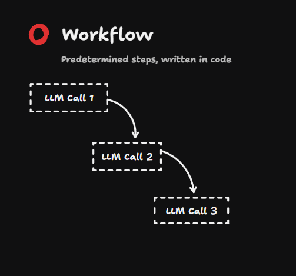
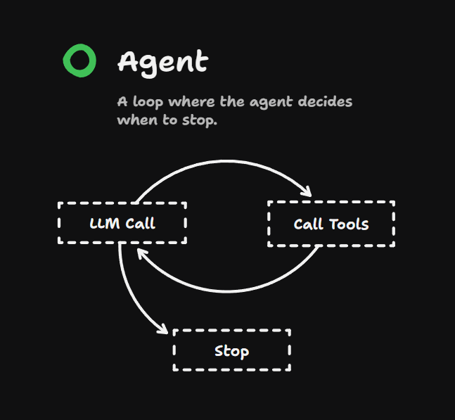
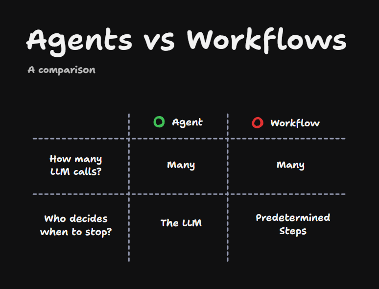
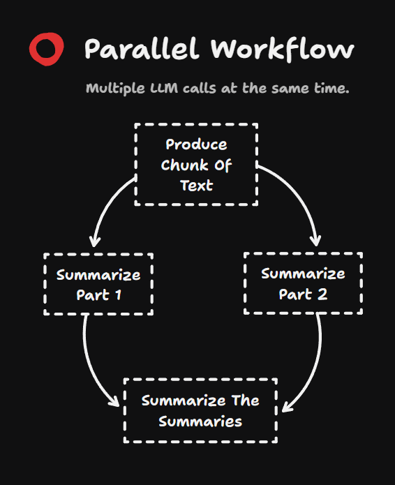

Ever since Anthropic dropped the article [building effective agents](https://www.anthropic.com/research/building-effective-agents), everyone's been talking about agents and workflows. Both agents and workflows are ways of building more powerful systems with LLMs, and they both involve orchestrating multiple calls to the LLM.

## What is a Workflow?

A workflow does this through predetermined steps where you have one LLM call which goes to another call which goes to another call. These predetermined steps are written in code by the developer.

The code itself decides when to stop the program, when to call the next LLM. It's all written into the code itself.

## What is an Agent?

An agent, though, doesn't use predetermined steps. It calls an LLM and gives it a bunch of tools, different options of things that it can do next. The LLM decides which tool to call and then responds to the result of those tools.

The LLM itself decides when to stop the program when it thinks it's finished. In other words, this is the LLM making it up as it goes along, which hands a lot more power to the LLM, but of course makes it less predictable.

## Comparing Agents and Workflows

Both agents and workflows involve multiple LLM calls. If you're just making one LLM call, it's not really either of those things.

The crucial difference is who decides when to stop:

Agents are really good in situations where the steps to complete the task are not particularly clear, where it needs the ability to improvise to figure out its way through a difficult problem.

But workflows are great for things that need to be done the same way again and again. Workflows are often unfairly maligned because they're not as exciting and sexy as agents.

You'll often get better results from using a workflow than using an agent, as long as the task is clearly specified.

## Parallel Workflows Example

For instance, you can use a workflow to parallelize work. Let's say we take in a chunk of text, we can split it into two parts, summarize each of them independently, and then summarize the summaries afterwards.

That's the difference between agents and workflows. I don't know whether it's me being old and boring, but I am more excited by workflows than agents.
