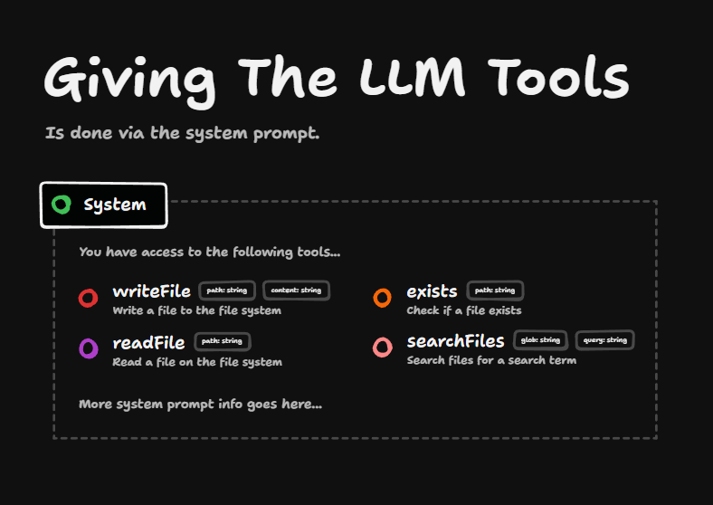
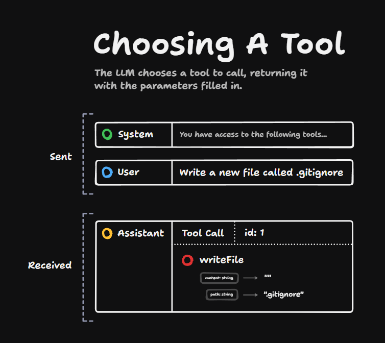
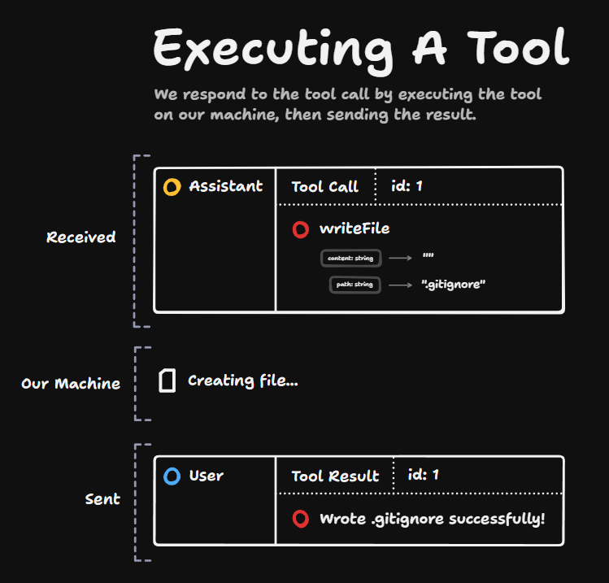
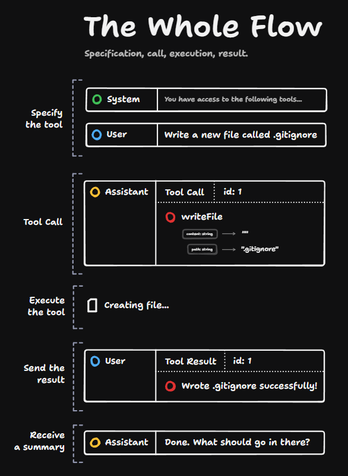

Giving the LLM tools is done via the system prompt. The system prompt is just another message in the message history which describes to the LLM what it's supposed to be doing, and in this case, what tools it can call.

For each tool, we're providing three things:

1. The name of the tool (e.g., `writeFile`)
2. A description of the tool (e.g., "Write a file to the file system")
3. The parameters it takes and their types (e.g., `path` and `content`)

These parameters are specified in JSON schema, so we can pass anything that JSON schema supports, like objects, arrays, and other complex types.

These tool definitions get injected into the system prompt, and any other information you've provided to the system prompt goes below it. There's nothing particularly fancy going on - it's just tool definitions inside the system prompt.

## The LLM Chooses a Tool

The magic happens when we ask the LLM to choose a tool. We've got our system prompt saying "You have access to the following tools." Then we add a user message, which says, "Write a new file called .gitignore."

We then receive back an assistant message with a tool call inside. This is just an instruction from the LLM indicating which tool to call. It has an `id` on it and also contains the required parameters.

In this example, it's writing an empty file to the path ".gitignore".

## Tool Calls vs. Tool Execution

This tool call is just an instruction for which tool should be called. Nothing has happened yet - the assistant has just produced a message. That's it.

The tool then needs to be executed on our machine. The LLM has created this message, but we then need to actually execute the creation of the file on our machine.

## Implementation Requirements

This means that for every single tool in the system prompt, we're going to have functions in our code base that match up to those.

If the tool execution is successful, we're then going to send back a user message to the LLM. It's going to have the same `id` as the previous tool call, and we're going to send it a message saying what happened when we executed the tool.

## Handling Errors

This error handling is really important. If there are any errors when the tool is executed, we need to show that error message to the LLM so that it can do something differently.

So a tool result could be a success or it could be a failure.

## The Complete Flow

Let's go one more time through the entire flow:

1. We specify the tool in the system prompt: "You have access to the following tools..." passing it a bunch of JSON schema
2. We send a user message saying "Write a new file called .gitignore" (note that we don't have to specifically say "call this tool" - the LLM itself decides which tool to call)
3. The LLM produces a tool call message with all the right parameters
4. We see this tool call message and execute it on our machine
5. We send the result back with a message saying what happened
6. The LLM sees this entire history and responds with a summary

In this case, it said "Done. What should go in there?"

## Summary of Tools

That's what tools are - they're just ways of getting LLMs to produce certain types of messages which you can then intercept and execute on your machine, and give those results back to the LLM.

With this simple loop, you can build really, really powerful applications.
