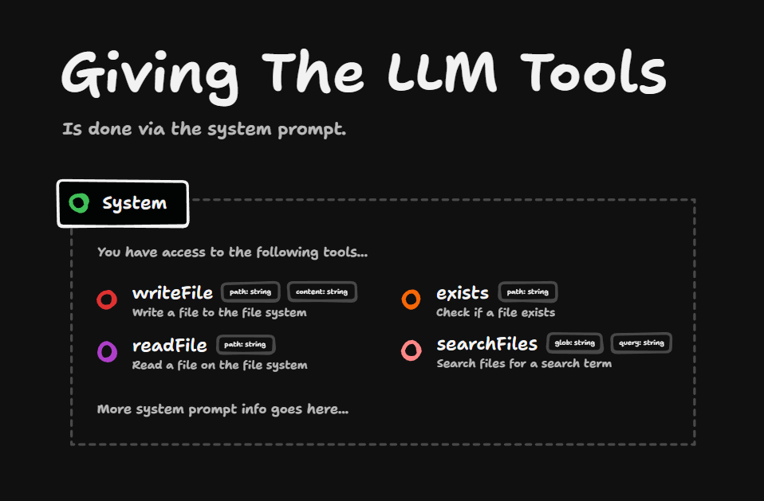
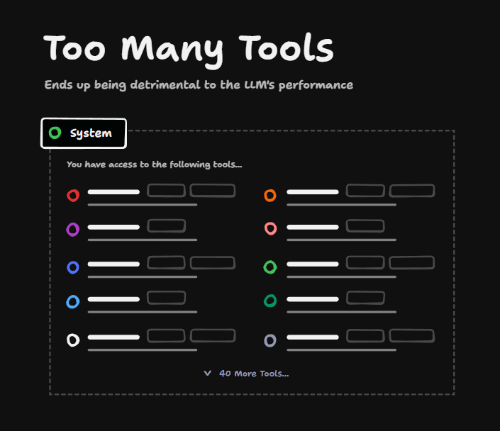
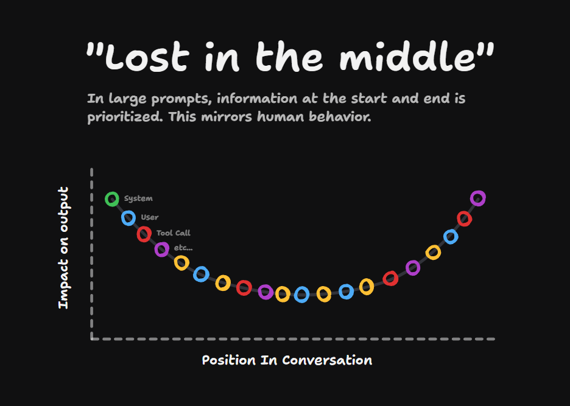

# The Problem with Too Many Tools in LLMs

Here's something that I wish I knew before I started using LLMs for serious projects: the more tools that you give the LLM, the worse it performs.

## How LLM Tools Work

I've talked before on the channel about how LLM tools work. They're just definitions added in via the system prompts.

You provide:

- A title
- A description
- Some JSON schema with the things that the tool needs to run

The rest of the system prompt information just goes below the tools.

## The Too Many Tools Problem

This works fine for like 6-8 tools depending on the model. But if you have dozens and dozens of tools, you're going to fill up your system prompts really quickly with all of these tool definitions.

## Lost in the Middle

The reason this makes it worse is that each of these tool definitions is using up space. And the more stuff you have in the context window, the more issues you're going to have with lost in the middle problems.

This is a well-known phenomenon where things in the middle of the conversation are less prioritized by the LLM - and it's more pronounced the larger the context window gets.

In other words, if you have like 50, 60 tool definitions, or even as many as 12, the LLM is going to have a hard time figuring out which tool definition it wants to use for any situation.

## Best Practices

So when you're working with tools, you really want to make sure that only the ones that are needed are in the system prompt. And with MCP servers it's really easy to flood your setup with a bunch of tools.

Lots of apps like VS Code and Cursor allow you to enable and disable tools, and you'll definitely see better results if you disable the tools that aren't needed.

And if you're building AI-powered apps, you should always consider disabling the tools that aren't needed.
